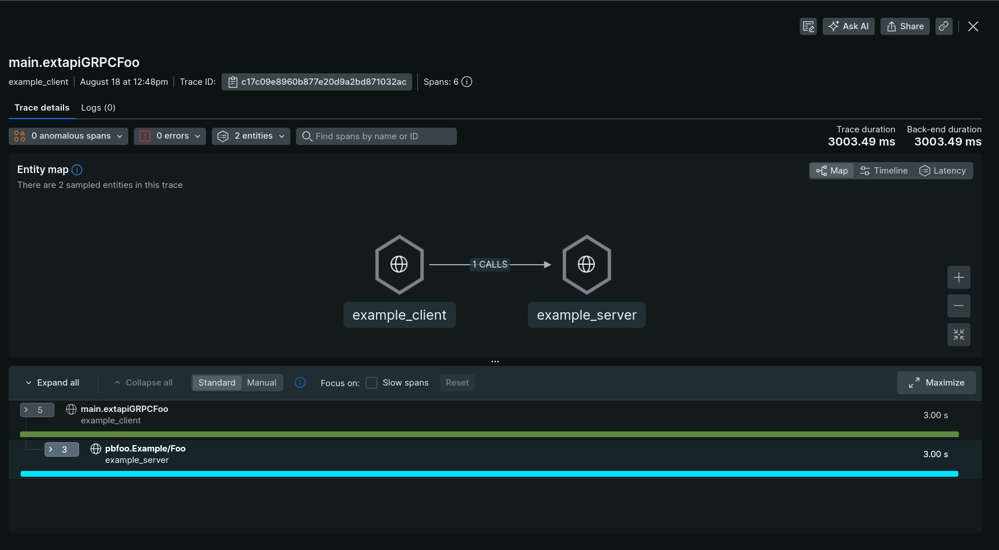
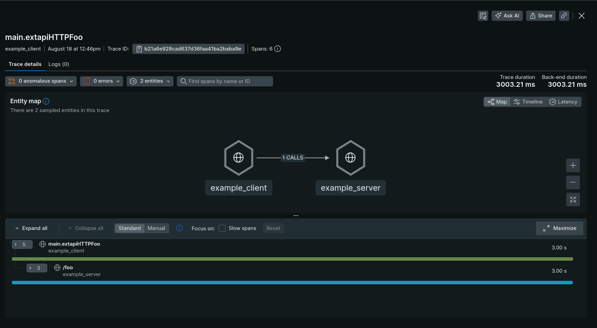

# oteltrace

# go-opentelemetry oteltrace

OpenTelemetry Trace.

## Usage

See [example server](./example/server/main.go) and [example client](./example/client/main.go).

In New Relic you will get.

